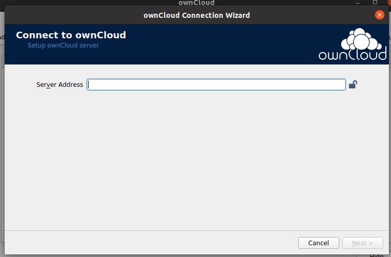
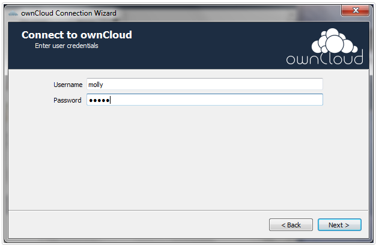
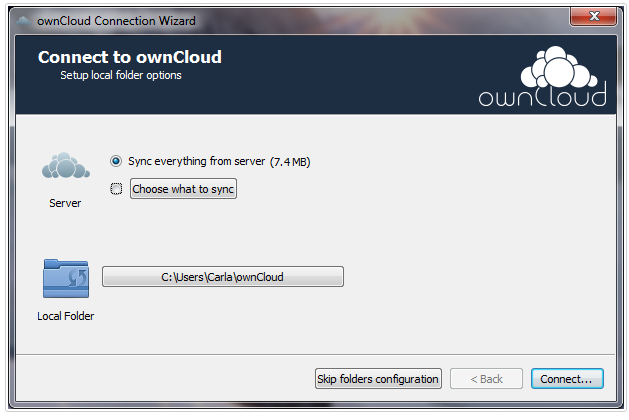
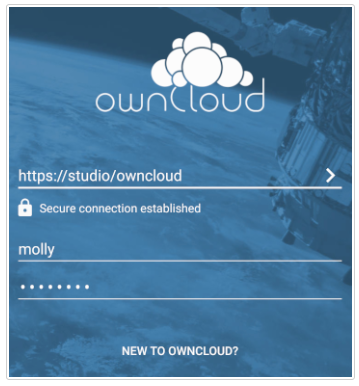
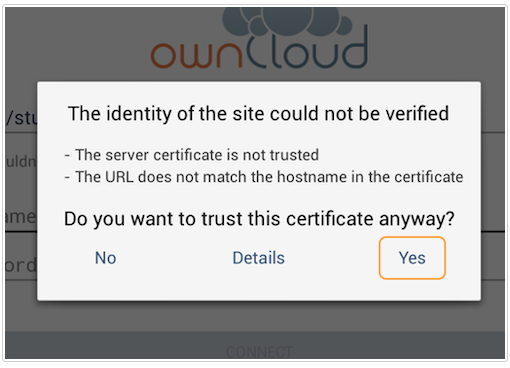
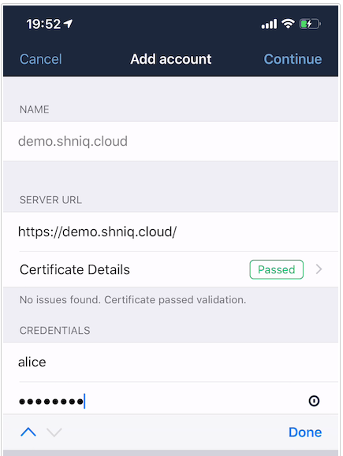
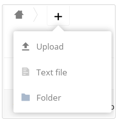

# Administrative and User Guide

Admins will be in charge of configuring the ownCloud server and creating users with the needed permissions. For the process to install and configure the ownCloud server see the [**Manually Installing ownCloud with the Linux Command Line**](MANUAL-INSTALL.md) topic.

## Admin Task: Creating a User Account

As an Administrator user, from the 'Users' page, there will be a table showing all created users. At the top of this table there are three fields with a 'Create' button.

1. **Username** - This value will be the user name that your created user will need to login. The username may contain letters (a-z, A-Z), numbers (0-9), dashes (-), underscores (_), periods (.), and at signs (@).
1. **E-Mail** - The user's email where their generated first-use password will be sent.
1. **Groups** - This dropdown field allows the admin to move users to created groups. By default, users are unassigned. 

When completed as desired, select the Create button to add the user. Admins may select additional fields to show on the table of users. For information on these configurations, see the [**User Configuration**](https://doc.owncloud.org/server/10.6/admin_manual/configuration/user/user_configuration.html#creating-a-new-user) section of the Admin Manual.

## User Task: Connecting to ownCloud

ownCloud allows users to connect via a Desktop client, an Android app, or an iOS app.

### For Desktop Users

Download the desktop application from [**the ownCloud downloads page**](https://owncloud.com/download/#desktop-clients).

Once downloaded, open the application and you will be prompted to enter your ownCloud server URL.

Next, enter your credentials to log into the server.

After the correct credentials are entered, you may choose to connect files to ownCloud from a local drive, or simply skip this step and connect to the server.

Once approved, you are ready to use the ownCloud desktop client. For more information on using desktop client, see the [**Using the Synchronization Client**](https://doc.owncloud.com/desktop/navigating.html) topic in the Desktop Client manual.

### For Android Users

Navigate to the [Google Play Store](https://play.google.com/store/apps/details?id=com.owncloud.android) and download the ownCloud app.

Open the app once it is installed. Enter your credentials into the login screen:

Once logged in, if the ownCloud server is using self-signed SSL certificates, select 'Yes' when asked if you wish to trust this unverified certificate.

The app is ready for use. For more information on using your Android app, see the [**Using the Android App**](https://doc.owncloud.com/android/) topic in the Mobile App for Android document.

### For iOS Users

The iOS ownCloud application is available in [the iOS store](https://apps.apple.com/app/id1359583808?ls=1&utm_campaign=Mobile%20App%20Downloads%20via%20QR%20code%20(iOS)&utm_medium=qr&utm_source=owncloud.com).

Once installed, enter your credentials in the login screen.

Once the user account is added and logged in, you are ready to use the ownCloud iOS app. For more information on gaining access to the ownCloud server with the iOS app, see the [**Managing User Accounts**](https://doc.owncloud.com/ios-app/ios_accounts.html) topic in the Mobile App for Android document.

## User Task: Basic User Actions
When using the ownCloud Web interface, users willl see the Files page. This is where the user may upload new files, remove files, and share any files from the respository. Users may also make changes based on how their permissions are set by the administrator.

For more information on using the Web Application, see the [**Navigating the Main User Interface**](https://doc.owncloud.com/server/10.6/user_manual/files/webgui/navigating.html) section of the User Manual.

[Back to Home](index.md).