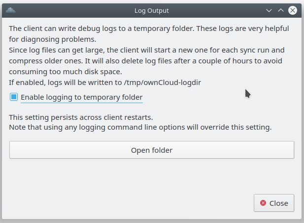

# Troubleshooting and Support   

The following sections are some common errors that users and admins may experience while using ownCloud.

## Installation Failure Error

The following error may occur if the installation fails:

    An unhandled exception has been thrown: exception ‘PDOException’ with message 'SQLSTATE[HY000]: General error: 1665 Cannot execute statement: impossible to write to binary log since BINLOG_FORMAT = STATEMENT and at least one table uses a storage engine limited to row-based logging. InnoDB is limited to row-logging when transaction isolation level is READ COMMITTED or READ UNCOMMITTED.'

To avoid data loss when many users are working in parallel, creating a large load on the system, ownCloud uses the `TRANSACTION_READ_COMMITTED` transaction in isolation. This requires that admins configure binary logging correctly when using MySQL or MariaDB, as this guide uses, or to disable it completely.

Binary logging records all the changes to the database and how long each change took to complete. This method enables replication and support backup operations. If admins wish to enable binary logging, then the following database change must be done.

In the database configuration file, change `BINLOG_FORMAT = STATEMENT` to either `BINLOG_FORMAT = MIXED` or `BINLOG_FORMAT = ROW`. These values may reside in the database startup script.

For more infromation on setting the `TRANSACTION_READ_COMMITTED` transaction isolation level, see the [MySQL manual](https://dev.mysql.com/doc/refman/5.7/en/set-transaction.html).

## Log Files in the Desktop Application

Without a log file, any issues that arise will be difficult to troubleshoot. One solution to gaining log files is to create a temporary directory where log files are stored.

From the ownCloud client, press the `F12`, `Ctrl+L`, or `Cmd+L` buttons, depending on your operating system. The Log Output dialog will display.

On this dialog, select the 'ENable loging to temporary folder' checkbox. Now, to attain log files for the desktop client, click the 'Open Folder' to navigate to the directory with the log files.

[Back to Home](index.md).